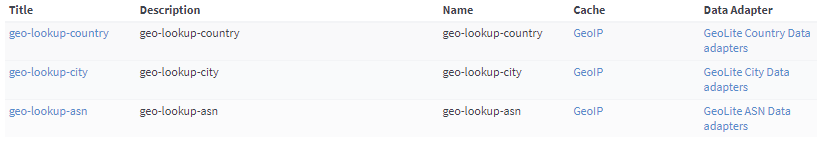
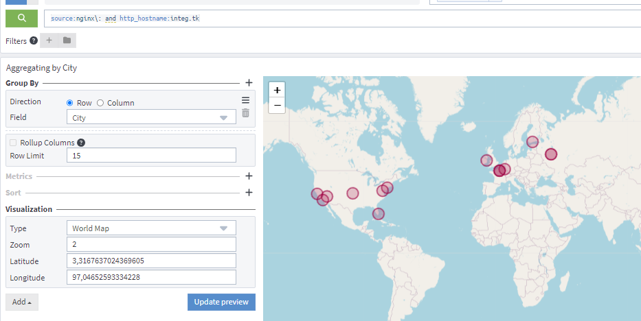

This is a set of extractors for use within Graylog, to parse the output of
Pfsense filter and Nginx logs.
# Prerequisites
#### Pfsense 2.6.0-RELEASE
* Select Log Message Format to "syslog (RFC 5424, with RFC 3339 microsecond-precision timestamps)"
* Set Remote log servers
* check Remote Syslog Content


#### Graylog 5
##### System/Input => Syslog UDP: 
* Set store_full_message: false

It is no need anymore ;)

# Installation
## Extractor
* Open the Graylog administrative interface
* Open the "System/Inputs" menu
* Select "Inputs"
* Select "Manage Extractors" for the input that receives Pfsense logs
* Select "Actions" menu
* Select "Import extractors"
* Paste the contents of [extractors.json](extractors.json), into the text box
* Select the button "Add extractors to input"
* Repeat import extractors for [extractor_Nginx.json](extractor_Nginx.json)

## Lookup Table
* Check that you have the same configuration as the capture 

## Nginx precaution
* For Nginx, thanks to respect this log format:
```
"$http_x_forwarded_for" - $remote_user [$time_local] "host: $host" "$request" '
'$status $body_bytes_sent "$http_referer" '
'"$http_user_agent" $request_time "$http_x_forwarded_proto"'
```

# Usage
## Exemple 1
* Open your Graylog search
* Search for `application_name:filterlog`
* The search results should now be showing all TCP/UDP/ICMP data as separate fields

## Exemple 2
What is interesting is the passage of the IPs to the lookup tables in order to obtain either the City, Country, or ASN coordinates (and tell me what it is ;))

Yes, we will get SourceCity, DestCity and City. With the world map, we will aggregate the data.




# GeoIP
* Set order Message Processors Configuration in menu System/Configuraiton
```
n	: Message Filter Chain
n+1	: GeoIP Resolver
```

# Background
Thank you for this repository https://github.com/facyber/pfSense-Graylog-Extractor.git
but I had to adapt to work :?
